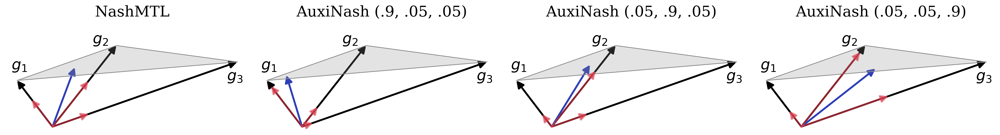

# AuxiNash

Official implementation of _"[Auxiliary Learning as an Bargaining Game](https://arxiv.org/abs/2301.13501)"_.



## Setup environment

```bash
conda create -n auxinash python=3.9
conda activate auxinash
conda install pytorch==1.9.0 torchvision==0.10.0 cudatoolkit=10.2 -c pytorch
```

Install the repo:

```bash
git clone https://github.com/AvivSham/auxinash.git
cd auxinash
pip install -e .
```

## Run experiment

To run NYUv2 experiment:

```bash
cd experiment/nyuv2
python trainer.py --method=auxinash
```
Follow instruction on the experiment README file for more information regarding, e.g., datasets.

You can also replace `auxinash` with on of the following Auxiliary / MTL methods.

We also support experiment tracking with **[Weights & Biases](https://wandb.ai/site)** with two additional parameters:

```bash
python trainer.py --method=auxinash --wandb_project=<project-name> --wandb_entity=<entity-name>
```

## Auxiliary & MTL methods

We support the following Auxiliary & MTL methods with a unified API. To run experiment with MTL method `X` simply run:
```bash
python trainer.py --method=X
```

| Method (code name) | Paper (notes) |
| :---: | :---: |
| Auxilearn (`auxilearn`) | [Auxiliary Learning by Implicit Differentiation](https://arxiv.org/abs/2007.02693) |
| GCS (`gcs`) | [Adapting Auxiliary Losses Using Gradient Similarity](https://arxiv.org/abs/1812.02224) |
| Nash-MTL (`nashmtl`) | [Multi-Task Learning as a Bargaining Game](https://arxiv.org/pdf/2202.01017v1.pdf) |
| CAGrad (`cagrad`) | [Conflict-Averse Gradient Descent for Multi-task Learning](https://arxiv.org/pdf/2110.14048.pdf) |
| PCGrad (`pcgrad`) | [Gradient Surgery for Multi-Task Learning](https://arxiv.org/abs/2001.06782) |
| Linear scalarization (`ls`) | - (equal weighting) |


## Citation

If you find `AuxiNash` to be useful in your own research, please consider citing the following paper:

```bib
@article{shamsian2023auxiliary,
  title={Auxiliary Learning as an Asymmetric Bargaining Game},
  author={Shamsian, Aviv and Navon, Aviv and Glazer, Neta and Kawaguchi, Kenji and Chechik, Gal and Fetaya, Ethan},
  journal={arXiv preprint arXiv:2301.13501},
  year={2023}
}
```
